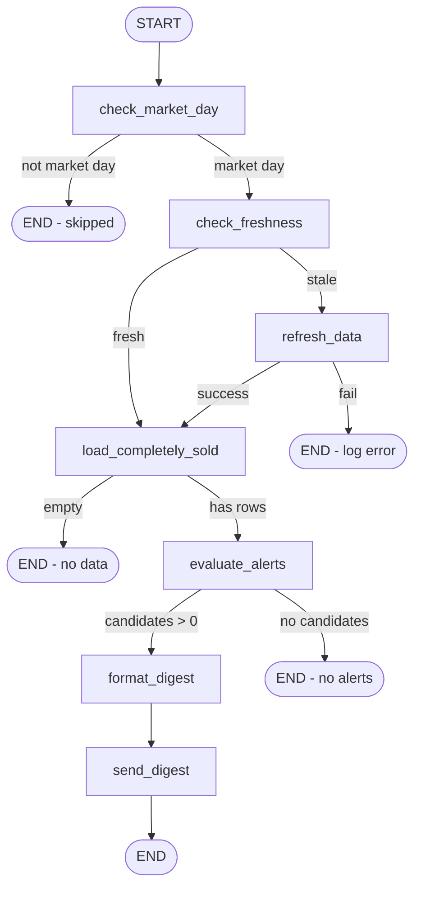

# Completely Sold Price Alert — Technical Design

**Purpose:** Technical design for LangGraph-orchestrated monitoring of **Completely_Sold** positions, **24h data refresh**, and **WhatsApp** alerts when price falls **≥ 5%** below last sold price.

**Parent plan:** [../COMPLETELY_SOLD_PRICE_ALERT_PLAN.md](../COMPLETELY_SOLD_PRICE_ALERT_PLAN.md)  
**Traceability:** [Prompts.txt](../collected_prompt_usecases/Prompts.txt) (lines 155–162)  
**Status:** Implemented in `C:\Investment\CompletelySoldAlert\`

---

## 1. Context — existing Investment components

```text
┌─────────────────────────────────────────────────────────────────┐
│ IBKR-Flex-BuySell (flex_buysell_report.py)                       │
│  Flex CSV download → merge → Excel                               │
│  Sheet: Completely_Sold                                          │
│    Last_Sold_Price, Current_Market_Price, Change_Since_Last_Sold_Pct │
└────────────────────────────┬────────────────────────────────────┘
                             │ read / subprocess refresh
                             ▼
┌─────────────────────────────────────────────────────────────────┐
│ CompletelySoldAlert/ (standalone — LangGraph + LangChain)          │
│  market_day? → freshness → refresh? → evaluate → digest → send   │
└────────────────────────────┬────────────────────────────────────┘
                             │
                             ▼
┌─────────────────────────────────────────────────────────────────┐
│ WhatsApp (Green API — AlertApp pattern)                          │
└─────────────────────────────────────────────────────────────────┘
```

### Key existing functions (reuse, do not duplicate)

| Module | Function | Role |
|--------|----------|------|
| `IBKR-Flex-BuySell/market_prices.py` | `enrich_completely_sold_with_market_prices` | Current price + `Change_Since_Last_Sold_Pct` |
| `IBKR-Flex-BuySell/flex_buysell_report.py` | `main()` / CLI | Regenerate workbook when stale |
| `AlertApp` / Green API | `sendMessage` | WhatsApp delivery |

---

## 2. Review decisions (locked)

| # | Decision | Implementation |
|---|----------|----------------|
| 1 | Price variance from **config file** | `alert.price_drop_threshold_pct` in `config/settings.yaml` |
| 2 | **One digest** per run | `format_digest` node → single `send_digest`; `notify.mode` fixed to `digest` |
| 3 | **Market days only** | `check_market_day` node first; NYSE calendar; skip weekends/holidays |
| 4 | **Separate project** | `C:\Investment\CompletelySoldAlert\` with own venv + LangChain/LangGraph deps |

---

## 3. Alert predicate (canonical)

Threshold is **always** loaded from settings — never hardcoded.

```python
def should_alert(row: dict, settings: AlertSettings) -> bool:
    threshold_pct = settings.alert.price_drop_threshold_pct
    change = row.get("Change_Since_Last_Sold_Pct")
    last_sold = row.get("Last_Sold_Price")
    current = row.get("Current_Market_Price")
    if change is None or last_sold is None or current is None:
        return False
    if last_sold <= 0 or current <= 0:
        return False
    return float(change) <= float(threshold_pct)
```

**Example** (`price_drop_threshold_pct: -5.0`): Sold AAPL at $200; current $190 → −5% → **alert**.  
At $195 → −2.5% → **no alert**. Change config to `-3.0` to alert earlier.

---

## 4. Architecture — standalone project

### 4.1 Package layout (`C:\Investment\CompletelySoldAlert\`)

```text
CompletelySoldAlert/
  .venv/                     # project-local virtualenv (not Investment root)
  config/
    settings.example.yaml    # committed template
    settings.yaml            # gitignored — threshold, WhatsApp, paths
  completely_sold_alert/
    __init__.py
    __main__.py              # CLI: run, dry-run, status
    config.py                # Pydantic Settings ← settings.yaml
    state.py                 # AlertState TypedDict
    graph.py                 # LangGraph compile
    nodes/
      market_day.py          # NYSE session gate
      freshness.py
      refresh.py
      load.py
      evaluate.py
      format_digest.py       # single readable WhatsApp body
      send_digest.py
    adapters/
      flex_report.py         # subprocess → IBKR-Flex-BuySell
      excel_loader.py
      whatsapp_green.py
    services/
      market_calendar.py     # is_market_day()
      cooldown.py
      digest_formatter.py    # WhatsApp layout
  data/                      # gitignored runtime state
  requirements.txt           # langgraph, langchain-core, pydantic, ...
  README.md
  run-alert.bat
  .gitignore
```

**Not** placed under `IBKR-Flex-BuySell\` or `AlertApp\` — those remain data/notification sources only.

### 4.2 Dependency stack (project-isolated)

| Package | Version policy | Use |
|---------|----------------|-----|
| `langgraph` | pin in project `requirements.txt` | Orchestration (framework boundary) |
| `langchain-core` | pin in project `requirements.txt` | Runnable / optional chains |
| `pydantic` | v2 | Load `settings.yaml` |
| `pydantic-settings` | optional | Env overlay for secrets |
| `pandas` / `openpyxl` | pin | Read Completely_Sold Excel |
| `exchange-calendars` | pin | NYSE market-day check |
| `pyyaml` | pin | Config file |

Install only inside `CompletelySoldAlert\.venv` — do not add LangGraph to `C:\Investment\requirements.txt`.

**v1:** No LLM required; LangChain used for graph/runnable wiring only.

---

## 5. LangGraph design

### 5.1 State schema

```python
class AlertState(TypedDict, total=False):
    # Settings (from config/settings.yaml)
    settings: dict

    # Market day gate
    is_market_day: bool
    market_calendar: str
    skip_reason: str | None

    # Freshness
    last_export_at: str | None      # ISO8601
    data_age_hours: float
    is_stale: bool

    # Refresh
    refresh_attempted: bool
    refresh_success: bool
    refresh_error: str | None
    report_path: str

    # Data
    completely_sold_rows: list[dict]
    row_count: int

    # Evaluation
    alert_candidates: list[dict]      # symbols passing threshold
    skipped_rows: list[dict]        # missing price / invalid

    # Notification (digest only)
    digest_text: str | None
    digest_sent: bool
    errors: list[str]
```

### 5.2 Graph diagram



### 5.3 Node specifications

#### `check_market_day`

| Input | `schedule.run_market_days_only`, `schedule.market_calendar`, `schedule.timezone` from settings |
| Logic | If `run_market_days_only` is false → pass through. Else use NYSE calendar: today must be a **valid trading day** (not weekend, not exchange holiday). |
| Library | `exchange_calendars` (`XNYS` schedule) |
| Output | `is_market_day`, `skip_reason` |
| Edge | `not is_market_day` → END with INFO log (no error) |

```python
import exchange_calendars as xcals

def is_market_day(calendar_name: str = "NYSE", tz: str = "America/New_York") -> bool:
    cal = xcals.get_calendar("XNYS")
    now = pd.Timestamp.now(tz=tz).normalize()
    return cal.is_session(now)
```

Task Scheduler may fire daily; this node is the authoritative gate.

#### `check_freshness`

| Input | `last_export.json` or `Report_Info` sheet timestamp |
| Logic | `is_stale = (now - last_export) > max_age_hours` (default 24) |
| Output | `is_stale`, `data_age_hours`, `last_export_at` |

If no prior export record → treat as **stale** (force refresh).

#### `refresh_data`

| Action | `subprocess.run([python, flex_buysell_report.py, ...], cwd=IBKR-Flex-BuySell)` |
| Flags | Respect existing `config.ini`; do not pass tokens on CLI |
| On success | Update `last_export.json` with path, mtime, row counts |
| On failure | Set `refresh_success=false`; graph routes to END (no stale alerts) |

**Conditional edge:** only run when `is_stale`; skip when fresh (prices still re-fetched in load via existing enrich or live yfinance in evaluate).

#### `load_completely_sold`

| Action | Read Excel sheet `Completely_Sold` → `list[dict]` |
| Optional | Re-call `enrich_completely_sold_with_market_prices` if `Price_As_Of` older than N hours (v1: always refresh quotes in evaluate node) |

#### `evaluate_alerts`

| Action | Filter with `should_alert(row, settings)` using **`settings.alert.price_drop_threshold_pct`** |
| Cooldown | Remove symbols alerted within `notify.cooldown_hours` |
| Output | `alert_candidates` sorted by `Change_Since_Last_Sold_Pct` ascending (worst drop first) |

#### `format_digest`

| Action | Build **one** message string via `digest_formatter.py` (deterministic; no LLM in v1) |
| Output | `digest_text` |

#### `send_digest`

| Action | Single `whatsapp_green.send_message(chat_id, digest_text)` |
| Post-send | Update per-symbol cooldown store |
| v1 | **No** `per_symbol` mode — removed from design |

### 5.4 Where LangChain / LangGraph fit

| Framework | Role in this project |
|-----------|---------------------|
| **LangGraph** | Compiled state graph, conditional edges, node routing |
| **LangChain-core** | Optional `Runnable` wrappers; future LLM digest polish |
| **Not in v1** | OpenAI/Ollama calls, trading advice chains |

### 5.5 Optional LLM (Phase 3 only)

| Node | LLM role | Default |
|------|----------|---------|
| `format_digest` | Turn candidate table into short readable paragraph | Off |
| `decision_review` | **Not used** for buy/sell decisions | Off |

**Rule:** Price threshold decision is **never** delegated to LLM — only templating/summary.

```python
# Optional chain (Phase 3)
from langchain_core.prompts import ChatPromptTemplate

DIGEST_PROMPT = ChatPromptTemplate.from_messages([
    ("system", "Summarize these stock alerts in 3 bullets. No investment advice."),
    ("human", "{alert_table}"),
])
```

---

## 6. WhatsApp digest format (readability)

**Approved:** one message per run. Use WhatsApp-friendly structure: short header, blank lines, monospace-aligned rows where supported, bold via `*asterisks*`.

### 6.1 Template (deterministic v1)

```text
📉 *Completely Sold — Price Drop Alert*
📅 {run_date_et}  |  🔔 {count} symbol(s)
Threshold: *{threshold_pct}%* vs last sold price
━━━━━━━━━━━━━━━━━━━━

{for each symbol — worst first}
*{SYMBOL}*
  Sold:  ${last_sold:,.2f}  →  Now: ${current:,.2f}
  Change: *{change:+.1f}%*  |  Sold on: {last_sold_date}
  Profit when sold: ${profit:,.0f} ({profit_pct:+.1f}%)

━━━━━━━━━━━━━━━━━━━━
📊 Monitored: {total_completely_sold} closed positions
⏭ Cooldown: symbols alerted in last {cooldown_hours}h omitted
_Source: IBKR Completely_Sold · Yahoo Finance_
```

### 6.2 Formatter rules

| Rule | Reason |
|------|--------|
| Sort by `Change_Since_Last_Sold_Pct` ascending | Worst drops at top |
| Max symbols per message | Config `notify.digest_max_symbols` (default 15); overflow: “+N more…” line |
| Skip rows with missing prices | Listed in footer as “skipped (no quote)” count |
| No wall of bullets | Section per symbol improves mobile scan |
| `*bold*` for symbol and change | WhatsApp markdown |

### 6.3 `digest_formatter.py` interface

```python
def build_digest(
    candidates: list[dict],
    settings: AlertSettings,
    meta: DigestMeta,
) -> str:
    ...
```

---

## 7. Freshness and 24h re-fetch

### 7.1 `last_export.json` (recommended)

```json
{
  "report_path": "C:/Investment/IBKR-Flex-BuySell/reports/IBKR_BuySell_Since_2020.xlsx",
  "exported_at": "2026-05-30T14:22:00-04:00",
  "completely_sold_count": 42,
  "source": "flex_buysell_report",
  "success": true
}
```

Written by:

- `refresh_data` node after successful subprocess, **or**
- Hook in `flex_buysell_report.py` (future enhancement — optional)

### 7.2 Staleness pseudocode

```python
def is_data_stale(last_export_at: datetime | None, max_age_hours: float = 24.0) -> bool:
    if last_export_at is None:
        return True
    age = (datetime.now(timezone.utc) - last_export_at).total_seconds() / 3600
    return age > max_age_hours
```

### 7.3 Re-trigger scope

“Re-execute fetch feature” = full **`flex_buysell_report.py`** pipeline (Flex download + merge + Completely_Sold + market enrich), not only Yahoo price refresh — ensures new closed positions appear.

---

## 8. WhatsApp integration

### 8.1 Provider matrix

| Provider | Existing code | Recommendation |
|----------|---------------|----------------|
| **Green API** | `AlertApp/readme.txt` | **Default** — headless, stable |
| CallMeBot | `stock_whatsapp_monitor.py` | Fallback |
| Twilio | root monitor | Optional |

### 8.2 Configuration (`config/settings.example.yaml`)

```yaml
# Copy to settings.yaml — all tuning here (no hardcoded thresholds in code)

alert:
  price_drop_threshold_pct: -5.0   # notify when Change_Since_Last_Sold_Pct <= this

data:
  max_age_hours: 24
  flex_project_dir: C:/Investment/IBKR-Flex-BuySell
  report_path: C:/Investment/IBKR-Flex-BuySell/reports/IBKR_BuySell_Since_2020.xlsx
  flex_python: python

schedule:
  run_market_days_only: true
  market_calendar: NYSE
  timezone: America/New_York

whatsapp:
  provider: green_api
  id_instance: ""          # or env GREEN_API_ID_INSTANCE
  api_token: ""            # or env GREEN_API_TOKEN
  target_phone: "1234567890"

notify:
  mode: digest               # v1: digest only
  cooldown_hours: 24
  digest_max_symbols: 15

llm:
  enabled: false
```

---

## 9. CLI and scheduling

### 9.1 CLI commands (planned)

```bash
python -m completely_sold_alert run           # full graph
python -m completely_sold_alert run --dry-run # evaluate only, no WhatsApp
python -m completely_sold_alert status       # show last export + cooldowns
python -m completely_sold_alert refresh-only  # force flex report
```

### 9.2 Windows Task Scheduler

| Trigger | Daily ~16:30 **America/New_York** (post-market) on weekdays |
| Action | `C:\Investment\CompletelySoldAlert\run-alert.bat` (activates `.venv`) |
| Graph gate | `check_market_day` skips weekends/holidays even if task fires |

---

## 10. Observability

| Event | Log level | Fields |
|-------|-----------|--------|
| `market_day_skip` | INFO | `date`, `calendar`, `is_market_day=false` |
| `freshness_check` | INFO | `data_age_hours`, `is_stale` |
| `digest_formatted` | INFO | `candidate_count`, `message_length` |
| `refresh_start` / `refresh_done` | INFO | `duration_ms`, `success` |
| `evaluate` | INFO | `row_count`, `candidate_count` |
| `notify_sent` | INFO | `symbol_count`, `provider` |
| `notify_skipped_cooldown` | DEBUG | `symbols[]` |
| `error` | ERROR | `node`, `message` (no secrets) |

Optional: write `data/last_run.json` audit artifact per execution.

---

## 11. Testing strategy (pre-implementation)

| Test | Type | Description |
|------|------|-------------|
| `should_alert` with config | Unit | threshold `-5` vs `-3` from yaml fixture |
| `is_market_day` | Unit | Saturday false; known NYSE holiday false; Tue true |
| `build_digest` | Unit | snapshot text layout |
| Staleness 24h | Unit | 23h fresh; 25h stale |
| Graph routing | Integration | Mock refresh fail → no notify |
| Load sheet | Integration | Fixture Excel with 3 rows |
| Cooldown | Unit | Second run suppresses same symbol |
| WhatsApp | Manual | `--dry-run` default in dev |

Fixtures: synthetic `Completely_Sold` rows in repo (no live IBKR data).

---

## 12. Alternatives considered

| Approach | Verdict |
|----------|---------|
| LangGraph orchestration | **Approved for design** — matches prompt; clear branches |
| Cron + single script | Simpler fallback if LangGraph rejected at review |
| Excel-only manual filter | Status quo — no automation |
| Power Automate watch folder | Rejected — opaque, hard to test |

---

## 13. Implementation checklist

- [ ] Scaffold `C:\Investment\CompletelySoldAlert\` + `.venv` + pinned LangGraph/LangChain
- [ ] `settings.yaml` + Pydantic loader (`price_drop_threshold_pct`)
- [ ] Nodes: `check_market_day`, freshness, refresh, load, evaluate, `format_digest`, `send_digest`
- [ ] `digest_formatter.py` (readable single message)
- [ ] `market_calendar.py` (NYSE / `exchange_calendars`)
- [ ] `flex_report` subprocess adapter
- [ ] `excel_loader` for Completely_Sold
- [ ] Green API notifier + dry-run
- [ ] Cooldown store
- [ ] Unit tests + fixture Excel
- [ ] `run-alert.bat` + Task Scheduler doc
- [ ] Update `INVESTMENT-PROGRAMS-REFERENCE.md`
- [ ] Update `Prompts.txt` traceability

---

## Document history

| Version | Date | Notes |
|---------|------|-------|
| 0.1 | 2026-06-01 | Initial design from Prompts.txt |
| 0.2 | 2026-06-01 | Review: config threshold, digest-only, market days, separate project |
