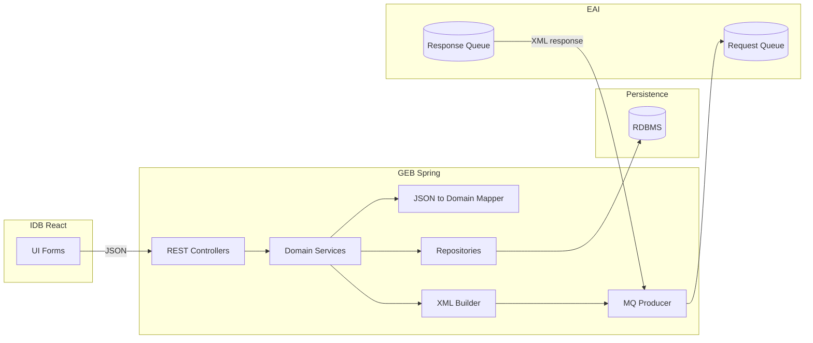
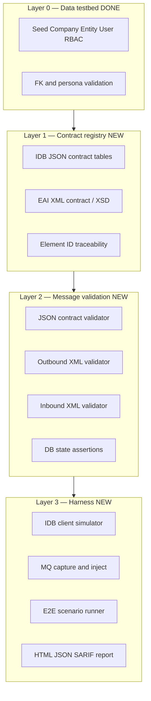
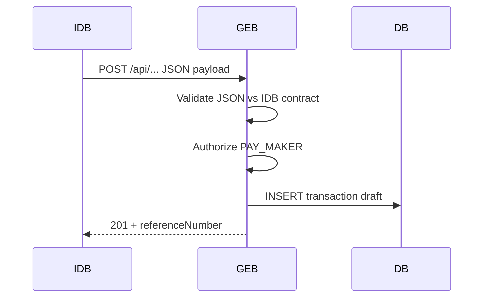
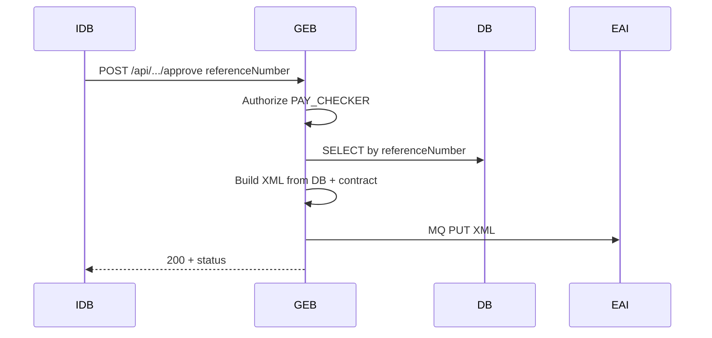
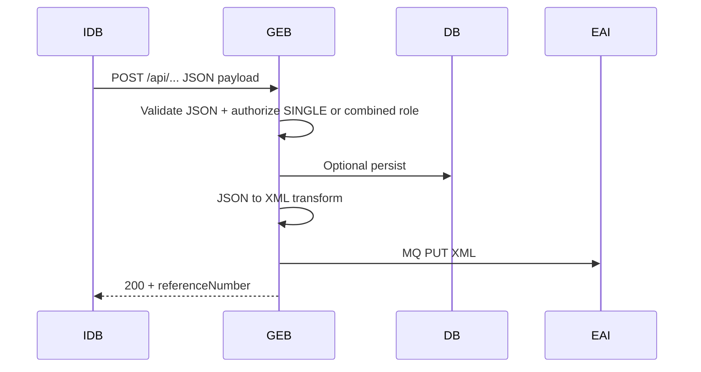
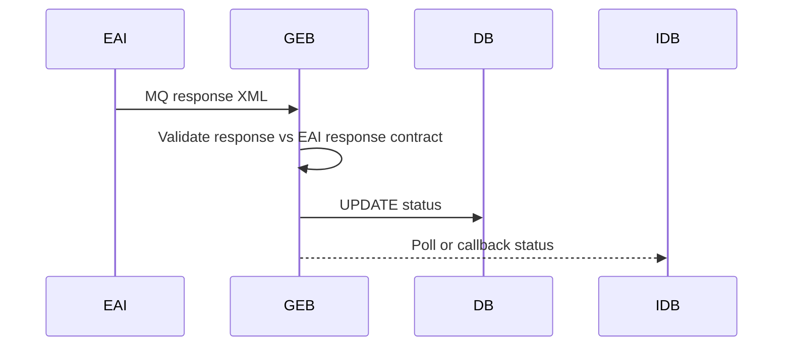
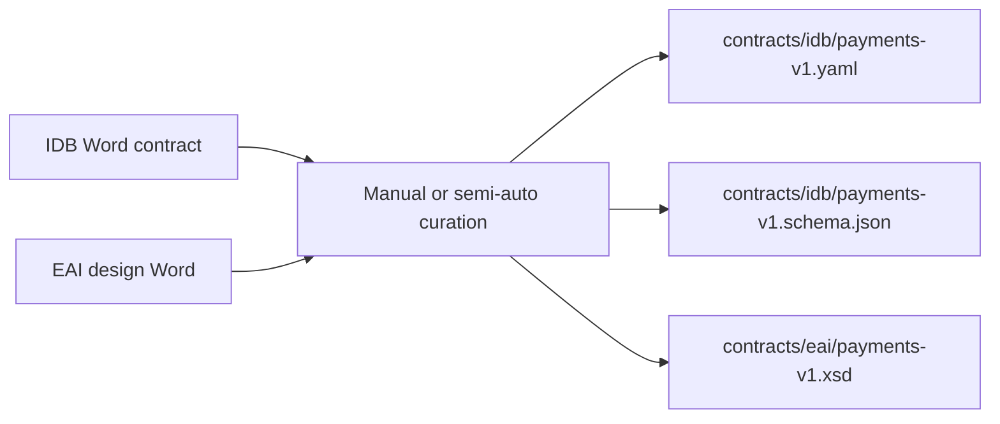

# GEB Integration Testbed — Design Plan

**Prompt source:** [Prompts.txt](../collected_prompt_usecases/Prompts.txt) lines 131–139  
**Related:** [TESTBED_DESIGN.md](TESTBED_DESIGN.md) (RBAC/data foundation — **implemented**) | [testbed_artifact_plan](../../../.cursor/plans/testbed_artifact_plan_caa349d6.plan.md)

**Status:** Planning — extends the existing Python testbed with **contract-driven message validation** for IDB ↔ GEB ↔ EAI.

---

## 1. Executive summary

Your organization’s flow is:

```text
IDB (React)  --JSON/REST-->  GEB (Spring)  --XML/MQ-->  EAI (downstream)
                              |
                              v
                           Database
```

GEB behaves differently by **user role**:

| Persona | IDB → GEB | GEB behaviour | GEB → EAI |
|---------|-----------|---------------|-----------|
| **Maker** | Full JSON business payload | Parse JSON, validate, **persist to DB** | No MQ (or optional “draft” — confirm in your design) |
| **Checker** | Reference number (+ approval metadata) | **Load from DB** by reference, build XML | **Send XML to EAI via MQ** |
| **Single user** | Full JSON payload | Parse, optionally persist, **convert to XML** | **Send XML to EAI via MQ** in one step |

The **integration testbed** must prove, for each scenario:

1. **Inbound API (IDB contract):** every required JSON element is present, typed, and bounded as agreed in the IDB interface document (Word tables).
2. **Outbound XML (EAI contract):** every required XML element appears in the message GEB sends, matching the EAI design document / XSD.
3. **Inbound XML (EAI response):** responses from EAI contain required elements and correlate to the outbound message (reference, message id, status).

The **existing testbed** (`testbed run-all`) already solves **who** can call GEB (users, roles, permissions, entities). This plan adds **what** must be in each message and **whether** GEB produced the correct downstream artefact.

---

## 2. Architecture under test



### 2.1 Validation boundaries

| Boundary | Format | Authority document | Testbed validates |
|----------|--------|-------------------|-------------------|
| IDB → GEB | JSON (REST) | IDB–GEB API contract (Word tables) | Request body + headers + HTTP semantics |
| GEB internal | Domain / JPA entities | Internal mapping spec | DB row vs JSON source (Maker) |
| GEB → EAI | XML on MQ | EAI message design / XSD | Outbound XML structure + values |
| EAI → GEB | XML on MQ | EAI response design / XSD | Inbound XML + correlation |

---

## 3. Testbed concept (two layers)



| Layer | Purpose | Tooling | Status |
|-------|---------|---------|--------|
| **0 — Data** | Realistic users and RBAC for Maker/Checker/Single | `Python/python-cursor/modules/python/testbed` | **Implemented** |
| **1 — Contracts** | Machine-readable rules from Word/design docs | YAML + JSON Schema + XSD | Planned |
| **2 — Validators** | Deterministic checks per message | Python (`jsonschema`, `xmlschema`, XPath) | Planned |
| **3 — Harness** | Drive GEB + capture MQ + report | Python CLI + Testcontainers / IBM MQ test | Planned |

---

## 4. Workflow scenarios (test cases)

### 4.1 Maker — submit and persist



**Testbed assertions**

| # | Assertion | Source |
|---|-----------|--------|
| M1 | HTTP 2xx, response schema matches IDB contract | JSON Schema |
| M2 | Every **required** field in Word table present in request | Contract table `required: true` |
| M3 | Field types, max length, enums match contract | Contract constraints |
| M4 | DB row exists with mapped fields = JSON values | SQL / repository query |
| M5 | No EAI outbound message (if design says Maker does not send MQ) | MQ capture empty |

### 4.2 Checker — approve and send to EAI



**Testbed assertions**

| # | Assertion | Source |
|---|-----------|--------|
| C1 | Request contains `referenceNumber` (and checker fields per contract) | JSON Schema |
| C2 | DB record loaded matches seeded Maker transaction | DB fixture |
| C3 | Outbound XML validates against EAI XSD | XSD |
| C4 | Every **required** EAI element present (Word/design table) | XPath checklist |
| C5 | XML values trace to DB (amount, currency, beneficiary, etc.) | Field mapping manifest |
| C6 | MQ headers (correlation id, message type) match EAI spec | Header rules |

### 4.3 Single user — straight-through



**Testbed assertions**

| # | Assertion | Source |
|---|-----------|--------|
| S1 | Full JSON contract (same as Maker payload rules) | JSON Schema |
| S2 | Outbound XML contract (same as Checker EAI rules) | XSD + XPath |
| S3 | End-to-end reference correlation IDB ↔ GEB ↔ MQ | Trace id manifest |
| S4 | Optional DB state if design persists before send | DB rules |

### 4.4 EAI response handling



**Testbed assertions**

| # | Assertion | Source |
|---|-----------|--------|
| R1 | Injected EAI response XML validates against response XSD | XSD |
| R2 | Required response elements present (status, error code, ack id) | XPath checklist |
| R3 | GEB updates DB status fields correctly | DB assertions |
| R4 | IDB-facing API reflects final status | JSON response schema |

---

## 5. Contract-driven design (Word tables → machine rules)

Corporate interfaces are often documented in **Word tables** (element name, type, mandatory, length, description). The testbed must not depend on Word at runtime.

### 5.1 Contract ingestion pipeline



**Canonical contract row** (one row per element):

```yaml
# contracts/idb/payments_submit_v1.yaml
api: payments.submit
version: "1.0"
direction: inbound
format: json
elements:
  - id: IDB-PAY-001
    path: "$.payment.header.messageId"
    name: messageId
    type: string
    required: true
    maxLength: 36
    description: Unique message id from IDB
  - id: IDB-PAY-002
    path: "$.payment.amount.value"
    name: amount
    type: decimal
    required: true
    pattern: "^\\d+(\\.\\d{1,2})?$"
```

```yaml
# contracts/eai/payments_outbound_v1.yaml
message: PaymentsInitiation
version: "1.0"
direction: outbound
format: xml
root: "/PaymentInitiation"
elements:
  - id: EAI-PAY-001
    xpath: "/PaymentInitiation/GrpHdr/MsgId"
    name: MsgId
    required: true
    mapsFrom: IDB-PAY-001
  - id: EAI-PAY-002
    xpath: "/PaymentInitiation/CdtTrfTxInf/Amt/InstdAmt"
    name: InstdAmt
    required: true
    mapsFrom: IDB-PAY-002
```

**Traceability:** `mapsFrom` links EAI elements to IDB elements for cross-boundary reports (“contract coverage”).

### 5.2 Validation engines

| Format | Library (Python) | Output |
|--------|------------------|--------|
| JSON | `jsonschema` + custom table walker | Per-element PASS/FAIL |
| XML | `xmlschema` or `lxml` + XSD | Schema + XPath required nodes |
| DB | SQL assertions via `mysql-connector` | Column-level diff |

---

## 6. Proposed package structure

Extend the repo under a new module (keeps Layer 0 testbed intact):

```text
repo-consolidated/Python/python-cursor/modules/python/
  testbed/                          # Layer 0 — RBAC seed (existing)
  geb-integration-testbed/          # Layer 1–3 — NEW
    contracts/
      idb/
        payments_submit_v1.yaml
        payments_submit_v1.schema.json
        collections_submit_v1.yaml
        trade_submit_v1.yaml
      eai/
        payments_outbound_v1.yaml
        payments_outbound_v1.xsd
        payments_response_v1.xsd
      mappings/
        payments_idb_to_eai.yaml      # field mapping manifest
    src/geb_testbed/
      cli.py
      config/
      contracts/
        loader.py                   # load YAML + schema + xsd
        compiler.py                 # Word CSV import helper (optional)
      validators/
        json_contract.py            # requirement 1
        xml_contract.py             # requirement 2
        db_assertions.py
        correlation.py              # reference / message id chain
      harness/
        idb_client.py               # httpx REST client as IDB
        mq_capture.py               # read/write test queues
        eai_stub.py                 # inject canned responses
      scenarios/
        maker_payments.py
        checker_payments.py
        single_user_payments.py
      reports/
        contract_matrix.html.j2     # tabular: element id, status, evidence
    tests/
      fixtures/
        json/maker_valid.json
        json/maker_missing_field.json
        xml/eai_expected_outbound.xml
        xml/eai_response_ack.xml
    scripts/
      run-geb-testbed.bat
      run-geb-testbed.sh
    pyproject.toml
    README.md
```

---

## 7. Validation report (tabular — mirrors Word contract)

The primary deliverable for reviewers is a **contract matrix** (exportable to Word/Excel):

| Contract ID | Element | Direction | Required | Received | Valid type | Evidence |
|-------------|---------|-----------|----------|----------|------------|----------|
| IDB-PAY-001 | messageId | Inbound JSON | Y | Y | Y | `payload.payment.header.messageId` |
| IDB-PAY-002 | amount | Inbound JSON | Y | N | — | **MISSING** |
| EAI-PAY-001 | MsgId | Outbound XML | Y | Y | Y | XPath match |
| EAI-PAY-002 | InstdAmt | Outbound XML | Y | Y | Y | Value=1000.00 |

Additional sections in HTML/JSON report:

- **Scenario:** Maker / Checker / Single user  
- **API:** method, path, status code  
- **MQ:** queue name, message id, payload hash  
- **DB:** reference number, row snapshot  
- **Overall:** PASS / FAIL with blocker list  

---

## 8. Test data strategy (reuse Layer 0)

| Need | Source |
|------|--------|
| Maker user token / login | `pay-maker-c101` from `testbed seed --scenario payments` |
| Checker user | `pay-checker-c101` |
| Single-user role | Dedicated role in contract config or `entity_user` extended |
| Company / entity context | Seeded `COMPANY_ID`, `ENTITY_ID` in headers or JSON |
| Pre-seeded transaction for Checker | `geb_testbed` fixture step: call Maker API once in setup |

**Recommended flow**

```cmd
testbed run-all --config config/settings.local.yaml
geb-testbed run --scenario checker_payments --geb-url http://localhost:8080
```

---

## 9. MQ and EAI simulation

| Approach | When to use | Pros |
|----------|-------------|------|
| **IBM MQ test queues** | Close to production | Real headers, persistence |
| **Testcontainers + MQ** | CI | Isolated, repeatable |
| **In-memory stub** | Fast dev | `geb_testbed.harness.eai_stub` records PUT, returns canned GET |
| **Recorded production samples** (masked) | Regression | Realistic edge cases |

**Capture pattern**

1. Start scenario with empty capture buffer.  
2. Invoke GEB API.  
3. Read all messages from `GEB.TO.EAI` queue (or stub).  
4. Validate each XML against outbound contract.  
5. Inject response XML into `EAI.TO.GEB`.  
6. Assert GEB processing + optional IDB status API.

---

## 10. Spring-side options (optional complement)

Python testbed is recommended for **contract matrix** reporting and CI. Optionally mirror critical paths in GEB repo:

| Approach | Use |
|----------|-----|
| `@WebMvcTest` + JSON Schema | Fast API contract unit tests |
| `@SpringBootTest` + Testcontainers | DB + MQ integration |
| WireMock IDB | Not needed if testbed plays IDB |
| Contract tests in build | Fail PR if `contracts/` version bump not validated |

**Division of labour:** Python owns **cross-system contract evidence**; Spring owns **mapper unit tests** inside GEB.

---

## 11. Implementation phases

| Phase | Duration | Deliverable | Depends on |
|-------|----------|-------------|------------|
| **0** | Done | RBAC testbed, MySQL seed, personas | — |
| **1** | 1–2 weeks | Contract YAML + JSON Schema for **one** IDB API (e.g. Payments Submit) | IDB Word table export |
| **2** | 1 week | JSON validator CLI + contract matrix report | Phase 1 |
| **3** | 1–2 weeks | EAI XSD + XML validator for outbound Payments | EAI design doc |
| **4** | 1 week | Maker E2E: IDB simulator → GEB → DB assert | Phases 0, 2 |
| **5** | 1 week | Checker E2E: reference → XML → MQ capture | Phases 0, 3, 4 data |
| **6** | 1 week | Single-user E2E + mapping trace report | Phases 3–5 |
| **7** | 1 week | EAI response inject + inbound XML validation | EAI response spec |
| **8** | 3–4 days | Collections + Trade contract packs (copy pattern) | Phases 1–7 template |
| **9** | 3–4 days | CI job + CMD/Git Bash scripts (no PowerShell) | All |

**Total estimate:** ~8–10 weeks with one developer; ~4–5 weeks with two (contracts + harness in parallel).

---

## 12. Success criteria

| # | Criterion |
|---|-----------|
| 1 | Every **required** IDB contract element has an automated test and appears in the matrix report |
| 2 | Every **required** EAI outbound element validated by XSD and XPath |
| 3 | Checker scenario proves XML values originate from DB row keyed by `referenceNumber` |
| 4 | Single-user scenario proves JSON → XML mapping without manual intervention |
| 5 | EAI response scenario proves required ack elements and DB status update |
| 6 | `geb-testbed run --all` completes in &lt; 5 minutes against local GEB + test MQ |
| 7 | Reports consumable by BA/reviewer (HTML + Excel export) without reading logs |

---

## 13. Risks and mitigations

| Risk | Mitigation |
|------|------------|
| Word contract drifts from code | Versioned `contracts/*` with PR check; owner signs contract version per release |
| JSON Schema too loose vs Word table | Generate schema from same YAML source as matrix |
| MQ environment unavailable in CI | Stub mode with recorded fixtures; MQ mode nightly |
| Sensitive data in fixtures | Synthetic Faker data; no production copy |
| GEB auth complexity | Reuse testbed users; OAuth test client or basic auth profile for dev |

---

## 14. Claude / LLM role (design-time only)

Same model as [TESTBED_DESIGN.md](TESTBED_DESIGN.md):

| Activity | Human + Claude | Runtime |
|----------|----------------|---------|
| Convert Word table → contract YAML | Yes | No |
| Propose missing XPath for EAI elements | Yes | No |
| Explain FAIL row in contract matrix | Yes | No |
| Execute validation | No | Python only |

---

## 15. Next steps

1. **Nominate pilot API** — e.g. Payments Submit (Maker) + Payments Approval (Checker).  
2. **Export** IDB Word table to CSV → first `contracts/idb/payments_submit_v1.yaml`.  
3. **Obtain** EAI XSD (or draft from design doc) → `contracts/eai/payments_outbound_v1.xsd`.  
4. **Scaffold** `geb-integration-testbed` Python package next to existing `testbed`.  
5. **Wire** `Prompts.txt` pointer and optional Jenkins stage after GEB deploy to test.

---

## 16. Relation to existing testbed artifact

| Concern | Existing `testbed` | New `geb-integration-testbed` |
|---------|-------------------|------------------------------|
| Users, roles, permissions | Yes | Consumes seeded data |
| JSON API validation | No | Yes |
| XML / MQ validation | No | Yes |
| DB seed only | Yes | Uses seed + asserts transaction rows |
| Word contract traceability | No | Yes (element IDs) |

**Recommendation:** Keep both tools. Run **data testbed** first, then **integration testbed** against a running GEB instance.
