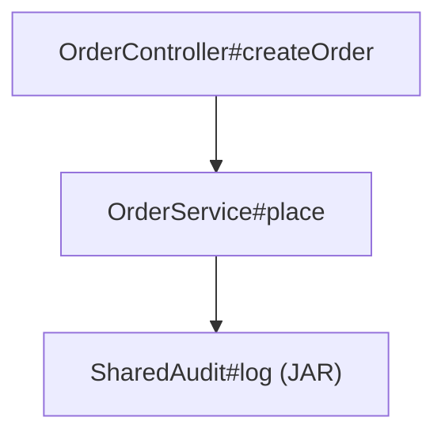

# Java Entry-Class Call Hierarchy — Design

**Purpose:** Technical design for a JavaParser-based analyzer that builds **class lists** and **method call hierarchy** from an **entry class/method** in modular web applications (Spring or plain Java).

**Parent plan:** [../JAVA_CALL_HIERARCHY_PLAN.md](../JAVA_CALL_HIERARCHY_PLAN.md)  
**Traceability:** [Prompts.txt](../collected_prompt_usecases/Prompts.txt) (lines 206–210)  
**Status:** P1 implemented — `Java/call-hierarchy-analyzer/` (Excel/CSV/JSON/Mermaid; JAR leaves via JarTypeSolver)  
**Open source:** [JavaParser](https://javaparser.org/) / [javaparser/javaparser](https://github.com/javaparser/javaparser) (core + **symbol-solver**)

---

## 1. Context and actors

| Actor | Role |
|-------|------|
| Developer / reviewer | Supplies entry class + method; consumes hierarchy for impact analysis. |
| Automation / TDD tooling | Invokes CLI or library to attach call trees to change requests. |
| Analyzer (new) | Indexes sources, resolves symbols, walks call graph, emits reports. |

### Example entry points

| Kind | Example |
|------|---------|
| Spring MVC/Web | `com.bank.web.PaymentController#submit(PaymentRequest)` |
| Plain service | `com.bank.batch.NightlyJob#run()` |
| Turbine / servlet-style | Any public method on an action/controller-like class |

The core must **not** require Spring annotations; Spring helpers are optional.

---

## 2. Gap vs existing spikes

| Artifact | What it does | Gap |
|----------|--------------|-----|
| `ReverseHierarchy/CalleeToCaller.java` | Builds reverse map by **simple method name** | No FQN, no overload safety, no multi-module TypeSolver |
| `PrintCallHierarchy/.../CallHierarchyExample.java` | Collects `MethodCallExpr` in one file | No resolution, no recursive hierarchy, hardcoded path |

**Design target:** typed, recursive, multi-root **caller → callee** hierarchy from a chosen entry.

---

## 3. Architecture

```text
┌─────────────────────────────────────────────────────────┐
│ CLI / Library API                                        │
│  --entry …  --source …  --jar …  --lib-dir …  --cp-file  │
└───────────────────────┬─────────────────────────────────┘
                        │
┌───────────────────────▼─────────────────────────────────┐
│ ProjectIndex / ClasspathFactory                          │
│  - parse .java under source roots                        │
│  - CombinedTypeSolver: JP sources → JarTypeSolver(s)     │
│    → Reflection(jreOnly)                                 │
│  - JavaSymbolSolver on ParserConfiguration               │
└───────────────────────┬─────────────────────────────────┘
                        │
┌───────────────────────▼─────────────────────────────────┐
│ EntryResolver                                            │
│  - locate CompilationUnit + MethodDeclaration            │
└───────────────────────┬─────────────────────────────────┘
                        │
┌───────────────────────▼─────────────────────────────────┐
│ CallGraphBuilder (+ JarBytecodeExpander P2)              │
│  - resolve calls (SOURCE or JAR)                         │
│  - recurse sources; JAR leaf (P1) or ASM expand (P2)     │
└───────────────────────┬─────────────────────────────────┘
                        │
┌───────────────────────▼─────────────────────────────────┐
│ Exporters (multi-format from same HierarchyReport)       │
│  Excel / CSV (origin + jar_name + Classpath sheet)       │
│  JSON │ Mermaid │ DOT │ HTML (optional)                  │
└─────────────────────────────────────────────────────────┘
```

### Layers (production principles)

| Layer | Responsibility |
|-------|----------------|
| CLI | Arg parsing, config load, exit codes, no business logic |
| Service (`CallHierarchyService`) | Orchestrate index → resolve → build → export |
| Analyzer / visitor | AST + symbol resolution only |
| Model | Immutable DTOs: `MethodRef`, `CallEdge`, `CallNode`, `HierarchyReport` |
| Export | Serialize report only |

---

## 4. Open-source stack

| Component | Role | Maven (illustrative) |
|-----------|------|----------------------|
| `javaparser-core` | Parse AST | `com.github.javaparser:javaparser-core` |
| `javaparser-symbol-solver-core` | Resolve types & methods | `com.github.javaparser:javaparser-symbol-solver-core` |
| **Apache POI** | Excel `.xlsx` write | `org.apache.poi:poi-ooxml` |
| OpenCSV or JDK writer | CSV write | `com.opencsv:opencsv` (or simple CSV util) |
| **ASM** (P2) | Walk invoke* inside JAR `.class` for expansion | `org.ow2.asm:asm` / `asm-tree` |
| `picocli` (optional) | CLI | `info.picocli:picocli` |
| JUnit 5 | Tests | standard |

**TypeSolver chain (order matters):**

1. `JavaParserTypeSolver` — each application **source root** (and optionally generated sources). **Prefer over JARs** when the same FQN exists in both.  
2. `JarTypeSolver` — **one instance per dependency JAR** (or per JAR listed under `--lib-dir`). Required for supporting classes that exist only as binaries.  
3. `ReflectionTypeSolver` — JDK types (`jreOnly=true` recommended so application classes are not silently taken from the analyzer’s own runtime classpath).

Use `CombinedTypeSolver` wrapping the above. Attach via:

```text
ParserConfiguration.setSymbolResolver(new JavaSymbolSolver(combinedTypeSolver))
StaticJavaParser.setConfiguration(config)  // or JavaParser instance per run
```

**Important:** Putting JARs on the **JVM `-cp` that launches the analyzer** is not enough by itself for Symbol Solver. Those JARs must also be registered as **`JarTypeSolver`** entries inside the analyzer configuration (CLI/config). Optionally, the analyzer process may also need them on `-cp` if using a non-jre-only Reflection solver — prefer explicit `JarTypeSolver` + `jreOnly=true`.

---

## 5. Core data model

```text
MethodRef
  typeFqn: String          // com.bank.service.OrderService
  methodName: String       // placeOrder
  paramTypeFqns: List      // [com.bank.api.OrderRequest]
  returnTypeFqn: String?
  sourceFile: String?      // relative path when SOURCE
  line: int?
  origin: SOURCE | JAR | JDK | UNKNOWN
  jarName: String?         // e.g. bank-common-1.2.3.jar

CallEdge
  from: MethodRef
  to: MethodRef
  kind: INVOKE | NEW | SUPER  // v1 focus: INVOKE + NEW
  callSiteLine: int?

CallNode
  method: MethodRef
  children: List<CallNode>
  depth: int
  leafReason: SOURCE_END | JAR_LEAF | FILTERED | UNRESOLVED | CYCLE | DEPTH_LIMIT

HierarchyReport
  entry: MethodRef
  classes: List<ClassRef>  // fqn, origin, jarName, firstDepth, package
  edges: List<CallEdge>
  root: CallNode
  unresolved: List<UnresolvedCall>
  cycles: List<String>
  classpathAudit: { sourceRoots[], jarsLoaded[], jarsMissing[] }
  meta: { depthLimit, expandJarPackages[], generatedAt }
```

**Method key (stable id):**  
`typeFqn + "#" + methodName + "(" + join(paramTypeFqns) + ")"`

---

## 6. Algorithm

### 6.1 Index

1. Collect all `.java` files under configured source roots (respect excludes: `target/`, `build/`, `generated` optional include).  
2. Discover JAR set (see §7.1): explicit `--jar`, `--lib-dir` scan (`*.jar`), `--classpath-file` (path separator split).  
3. Build `CombinedTypeSolver`: sources → each JAR → Reflection(jreOnly).  
4. Parse each source file into `CompilationUnit` with symbol solver enabled.  
5. Optionally build a map `MethodKey → MethodDeclaration` for fast entry lookup (sources only in P1).

### 6.2 Resolve entry

CLI forms (accepted):

```text
com.bank.web.OrderController#createOrder
com.bank.web.OrderController#createOrder(com.bank.api.OrderRequest)
com.bank.web.OrderController::createOrder
```

Rules:

- Entry method must come from **sources** in P1 (analyzing an entry that exists only inside a JAR is P2+).  
- If params omitted and multiple overloads exist → fail with list of candidates (exit non-zero).  
- Class not found → clear error listing searched source roots.

### 6.3 Expand call hierarchy

From current method body (**source AST** in P1):

1. Collect `MethodCallExpr`, `ObjectCreationExpr` (and nested lambda bodies).  
2. `resolve()` via symbol solver → `ResolvedMethodDeclaration` / constructor.  
3. Map to `MethodRef` with **origin**:
   - declaration found in source index → `SOURCE`  
   - declaration found only via `JarTypeSolver` → `JAR` (+ jar file name if trackable)  
   - JDK → `JDK` (usually filtered)  
4. Skip if package excluded.  
5. Recursion rules:
   - `SOURCE` + depth OK + not on path → open source `MethodDeclaration`, recurse.  
   - `JAR` in P1 → emit node, set `leafReason=JAR_LEAF`, **do not recurse**.  
   - `JAR` in P2+ and package matches `--expand-jar-package` → bytecode expand (§6.5).  
6. Resolve failure → `UnresolvedCall` with hint: *add dependency JAR via --jar / --lib-dir*.

### 6.4 Class list

Union of entry type + every edge endpoint; each row carries `origin` and `jarName`.

### 6.5 JAR bytecode expansion (P2)

When expanding a JAR method:

1. Locate `.class` inside the owning JAR (ASM `ClassReader`).  
2. Find method by name + descriptor matching resolved signature.  
3. Collect `INVOKEVIRTUAL` / `INVOKEINTERFACE` / `INVOKESPECIAL` / `INVOKESTATIC` / `INVOKEDYNAMIC` (best-effort).  
4. Map owners to FQNs; apply same filters; recurse with depth/cycle guards.  
5. Mark edges/nodes `origin=JAR`.  

Do **not** expand `org.springframework.*`, `java.*`, etc., unless explicitly requested.

---

## 7. Modular / multi-module support

| Config | Meaning |
|--------|---------|
| `sourceRoots[]` | e.g. `app-web/src/main/java`, `app-service/src/main/java` |
| `jars[]` | Explicit JAR files for `JarTypeSolver` |
| `libDirs[]` | Directories to scan for `*.jar` (non-recursive or recursive flag) |
| `classpathFile` | File produced by Maven/Gradle listing JAR paths |
| `includePackages[]` | e.g. `com.bank.` — only report / recurse into these |
| `excludePackages[]` | e.g. `org.springframework.`, `java.`, `jakarta.` |
| `expandJarPackages[]` | P2: packages allowed for bytecode descent into JARs |
| `maxDepth` | Default 20 |
| `followInterfaces` | P4: expand interface → source/JAR impls |

**Spring-specific (optional module):** unchanged — discovery helpers only; JAR rules still apply to supporting libs.

---

## 7.1 Making JARs visible to the program (required practice)

The analyzer only “sees” supporting JAR classes when they are registered in its **TypeSolver classpath**, not merely because the application was built with them.

### CLI / config knobs

```text
--jar C:\libs\bank-common-1.2.3.jar
--jar C:\libs\payments-api-4.0.jar
--lib-dir C:\libs\analyzer-libs
--lib-dir C:\deploy\exploded-ear\APP-INF\lib
--classpath-file cp.txt
--expand-jar-package com.bank.          # P2 only
```

Config file equivalent (YAML/properties) preferred for large lists — paths from env/config only.

### Recommended ways to collect JARs before analysis

| Source of truth | Prep command / action | Analyzer flag |
|-----------------|----------------------|---------------|
| **Maven module** | `mvn -q dependency:build-classpath -Dmdep.path -Dmdep.outputFile=cp.txt` | `--classpath-file cp.txt` |
| **Maven copy** | `mvn -q dependency:copy-dependencies -DoutputDirectory=analyzer-libs` | `--lib-dir analyzer-libs` |
| **Gradle** | Copy `sourceSets.main.compileClasspath` into `analyzer-libs` (small task) | `--lib-dir analyzer-libs` |
| **EAR/WAR deployable** | Explode artifact; point at `WEB-INF/lib` / `APP-INF/lib` / `lib` | `--lib-dir …/lib` |
| **Sibling module JAR** | `mvn -pl :shared-api -am package` then `--jar …/shared-api/target/shared-api-*.jar` | `--jar` |
| **Bank shared drive** | Copy approved shared JARs into a project-local `analyzer-libs/` (do not hardcode drive letters in code) | `--lib-dir` |

**Windows classpath file note:** Maven writes `;`-separated paths; Unix uses `:`. Analyzer must accept both (or detect OS / use a one-path-per-line format — prefer **one path per line** in a custom `jars.txt` for portability).

**Suggested helper (ship with tool):**

```text
scripts/prepare-classpath.sh|.bat
  → runs Maven/Gradle copy-dependencies
  → writes analyzer-libs/ + jars.list
  → prints example analyzer CLI
```

### What becomes visible

| With JARs registered | Without JARs |
|----------------------|--------------|
| Calls to `com.bank.shared.FooService#bar` resolve; class appears with `origin=JAR` | Same call → **Unresolved** |
| Overloads / param types from library APIs resolve correctly | Wrong overload or failure |
| Excel Classpath sheet lists loaded JARs | Empty / missing jars warning |

### Dual presence (source + JAR)

If module sources **and** the built JAR are both configured, **source wins** (TypeSolver order). Prefer listing source roots for in-repo modules and JARs only for **closed** supporting libraries.

---

## 8. CLI contract (P1)

```text
java -jar call-hierarchy-analyzer.jar \
  --entry com.bank.web.OrderController#createOrder(com.bank.api.OrderRequest) \
  --source app-web/src/main/java \
  --source app-service/src/main/java \
  --lib-dir analyzer-libs \
  --jar path/to/bank-common-1.2.3.jar \
  --classpath-file cp.txt \
  --exclude-package java. --exclude-package jakarta. --exclude-package org.springframework. \
  --max-depth 20 \
  --format excel,csv,json \
  --out out/hierarchy
```

**`--format`:** comma-separated; default `excel,csv`.  
**`--out`:** base path without extension.

**Exit codes:** `0` success; `2` entry ambiguous/missing; `3` parse/index failure; `4` I/O; `5` classpath incomplete warning-as-error if `--strict-classpath`.

**Library API (sketch):**

```java
AnalyzerConfig config = AnalyzerConfig.builder()
    .sourceRoots(List.of(Path.of("app-web/src/main/java")))
    .libDirs(List.of(Path.of("analyzer-libs")))
    .jars(List.of(Path.of("libs/bank-common-1.2.3.jar")))
    .build();
HierarchyReport report = new CallHierarchyService(config)
    .analyze(MethodRef.parse("com.bank.web.OrderController#createOrder(...)"));
```

---

## 9. Output formats

### 9.1 Excel workbook (primary for readability)

One `.xlsx` with sheets:

| Sheet | Purpose | Key columns |
|-------|---------|-------------|
| **Summary** | Glance metrics | entry, class_count, jar_class_count, edge_count, max_depth, unresolved_count, jars_loaded_count, generated_at |
| **Classes** | Dependency class list | class_fqn, simple_name, package, **origin**, **jar_name**, first_depth, role_hint |
| **Hierarchy** | Top-down reading | depth, indent_label, class_fqn, method, origin, jar_name, parent_method, path, leaf_reason |
| **Edges** | Filter / pivot | caller_class, caller_method, callee_class, callee_method, callee_origin, call_site_line, depth |
| **Unresolved** | Manual follow-up | caller, call_text, line, reason, **suggested_fix** (e.g. add JAR) |
| **Classpath** | Audit | kind (SOURCE_ROOT\|JAR), path, readable (Y/N) |
| **ClassMatrix** (optional P2) | Who depends on whom | caller class × callee class counts |

**Hierarchy sheet sample rows:**

| depth | indent_label | class_fqn | method | origin | jar_name | path |
|------:|--------------|-----------|--------|--------|----------|------|
| 0 | OrderController#createOrder | com.bank.web.OrderController | createOrder | SOURCE | | OrderController#createOrder |
| 1 | ··OrderService#place | com.bank.service.OrderService | place | SOURCE | | … > OrderService#place |
| 2 | ····SharedAudit#log | com.bank.shared.SharedAudit | log | JAR | bank-common-1.2.3.jar | … > SharedAudit#log |

### 9.2 CSV (same content, Git-friendly)

Emit parallel files (or a zip):

- `{out}-summary.csv`
- `{out}-classes.csv`
- `{out}-hierarchy.csv`
- `{out}-edges.csv`
- `{out}-unresolved.csv`
- `{out}-classpath.csv`

UTF-8 with header row; Excel-openable.

### 9.3 Other options for quick understanding

| Format | Why it helps |
|--------|----------------|
| **Mermaid flowchart** | Visual caller→callee; style JAR nodes differently (e.g. dashed) |
| **Markdown tree** | Lightweight text hierarchy in reviews |
| **Graphviz DOT** | Large graphs; render PNG/SVG offline |
| **HTML collapsible tree** (P2) | Browser search/filter; badge SOURCE vs JAR |
| **JSON** | Canonical machine format |

**Mermaid example:**



### 9.4 JSON (canonical)

```json
{
  "entry": {
    "typeFqn": "com.bank.web.OrderController",
    "methodName": "createOrder",
    "paramTypeFqns": ["com.bank.api.OrderRequest"],
    "origin": "SOURCE"
  },
  "classes": [
    { "typeFqn": "com.bank.web.OrderController", "origin": "SOURCE" },
    { "typeFqn": "com.bank.service.OrderService", "origin": "SOURCE" },
    { "typeFqn": "com.bank.shared.SharedAudit", "origin": "JAR", "jarName": "bank-common-1.2.3.jar" }
  ],
  "classpathAudit": {
    "sourceRoots": ["app-web/src/main/java"],
    "jarsLoaded": ["analyzer-libs/bank-common-1.2.3.jar"],
    "jarsMissing": []
  },
  "unresolved": [],
  "cycles": []
}
```

---

## 10. Limitations and mitigations

| Limitation | Mitigation |
|------------|------------|
| Reflection / dynamic proxies | Document; optional manual edge file later |
| Spring AOP / `@Transactional` proxies | Resolve to target type FQN when possible; do not invent advice edges in v1 |
| Interface injection without impl on classpath | `unresolved` + P4 interface→impl scan |
| **Supporting class only in JAR, JAR not supplied** | Unresolved + Classpath sheet; document `--lib-dir` / prepare-classpath script |
| **JAR leaf only in P1** (no body walk) | Document; P2 ASM expand for `--expand-jar-package` |
| Missing transitive Maven deps | Use `copy-dependencies` / full compile classpath, not a hand-picked single JAR when unsure |
| Lombok / generated code | Include `target/generated-sources` root when present |
| Cross-language (Kotlin) | Out of scope v1 |

**Observability:** structured log: sources parsed, jars loaded/skipped, resolve failures, jar-leaf count, elapsed ms — no secrets.

---

## 11. Suggested project layout

```text
repo-consolidated/Java/call-hierarchy-analyzer/
  pom.xml
  README.md
  scripts/prepare-classpath.bat
  scripts/prepare-classpath.sh
  src/main/java/.../cli/CallHierarchyCli.java
  src/main/java/.../config/AnalyzerConfig.java
  src/main/java/.../index/ProjectIndex.java
  src/main/java/.../index/ClasspathFactory.java   # builds CombinedTypeSolver + JarTypeSolver
  src/main/java/.../resolve/EntryResolver.java
  src/main/java/.../graph/CallGraphBuilder.java
  src/main/java/.../graph/JarBytecodeExpander.java  # P2
  src/main/java/.../model/*.java
  src/main/java/.../export/{Excel,Csv,Json,Mermaid,Dot,Html}Exporter.java
  src/test/java/.../fixtures/sample-app/...
  src/test/java/.../fixtures/sample-lib/            # tiny JAR fixture
  src/test/java/.../CallHierarchyServiceTest.java
  src/test/java/.../JarVisibilityTest.java
  src/test/java/.../export/ExcelCsvExporterTest.java
```

Reuse lessons from existing spikes; **do not** extend the hardcoded path demos in place — new Maven module keeps a clean production shape.

---

## 12. Testing strategy

| Test | Assert |
|------|--------|
| Unit: MethodRef parse | Overload forms, invalid input |
| Fixture mini-app: Controller → Service → Repo | Exact edge set + class list |
| **Fixture: Service → class only in test JAR** | Resolves with `origin=JAR`; appears in Excel Classes |
| **Same call without --jar** | Unresolved + suggested_fix |
| Cycle A→B→A | Cycle recorded; no infinite loop |
| Missing symbol | Appears in `unresolved`; exit 0 if entry ok |
| Non-Spring plain main | Same service path works |
| Multi-root | Cross-module call resolves |
| Excel/CSV export | Sheets include origin/jar_name/classpath |
| Mermaid export | Contains expected node labels and edges |

---

## 13. Security & config

- Paths only from CLI / config file / env — no hardcoded machine paths in code.  
- Analyzer is read-only on source trees and JARs.  
- Do not embed credentials for downloading JARs; **local paths only** (prep script may use existing Maven settings).  
- Do not load arbitrary remote URLs as JARs in v1.

---

## 14. Implementation phases (post-review)

| Phase | Work |
|-------|------|
| P1 | Maven module, TypeSolver (sources + **JarTypeSolver**), entry resolve, recursive source builder, JAR leaves, **Excel+CSV+JSON**, classpath audit, prepare-classpath script, fixture tests |
| P2 | Filters, Mermaid/DOT/HTML, ClassMatrix, **ASM JAR expansion** for include packages |
| P3 | Optional Spring entry discovery |
| P4 | Interface→impl heuristics |

---

## 15. Review checklist

- [ ] Entry signature format approved  
- [ ] Default exclude packages approved  
- [ ] Project path `Java/call-hierarchy-analyzer` approved  
- [ ] **Excel/CSV sheet layout** approved (incl. origin / jar_name / Classpath)  
- [ ] **JAR inclusion approach** approved (`--jar` / `--lib-dir` / `--classpath-file` + Maven/Gradle prep)  
- [ ] P1 JAR leaf vs P2 bytecode expand accepted  
- [ ] Proceed to implementation after checklist sign-off  
